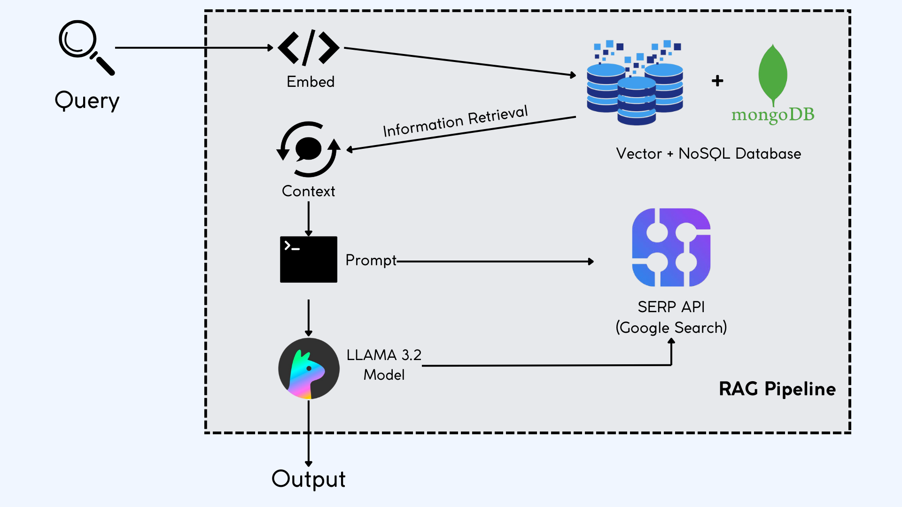

# **Ayuwave: AI-Powered Healthcare Platform**

Ayuwave revolutionizes healthcare by blending advanced AI technology with holistic wellness practices. It offers tailored health solutions, empowering users to manage their well-being through personalized fitness plans, dietary recommendations, and Ayurvedic remedies. The platform also ensures data security with blockchain-enabled medical record storage.

---

## **Key Features**

### **1. AI-Powered Data Collection with OCR**  
- Leverages **Optical Character Recognition (OCR)** to extract data from physical and digital health documents, ensuring precise and automated health data collection for personalized insights.

### **2. Personalized Fitness Plan Generator**  
- Uses **AI-driven algorithms** to create customized fitness routines based on the user’s health history, goals, and fitness levels, helping achieve optimal results.

### **3. Customized Diet Planning System**  
- Employs **machine learning models** to analyze user preferences, health needs, and lifestyle factors, delivering personalized diet plans to optimize nutrition.

### **4. Secure Medical Record Storage with IPFS and Pinata**  
- Implements the **InterPlanetary File System (IPFS)** for decentralized, secure storage of medical records, enhanced by **Pinata** for reliable file management and retrieval. This ensures data privacy, integrity, and seamless access for authorized healthcare providers.

### **5. Ayurvedic Remedy Recommendation Engine**  
- Powered by **AI**, the engine provides personalized Ayurvedic remedies based on symptoms, health conditions, and holistic wellness principles to help users maintain natural health balance.

### **6. Personalized Health Companion Chatbot**  
- A conversational AI-powered chatbot built with **Llama 3.2**, offering real-time health tips, personalized advice, and wellness guidance to help users maintain a healthy lifestyle.

### **7. Advanced AI Assistant with RAG and Llama 3.2**  
- Integrates **Retrieval-Augmented Generation (RAG)** technology with **Llama 3.2** to provide precise health-related advice, answer medical queries, and support advanced research using state-of-the-art natural language processing.

### **8. Efficient Data Management with ChromaDB**  
- Uses **ChromaDB**, a vector database, to store and manage large-scale unstructured health data, enabling fast and accurate retrieval of personalized recommendations and insights.

### **9. Modern, Scalable Web Interface**  
- Built with **React** for a dynamic, responsive user interface, and supported by **Flask** and **MongoDB** for efficient backend processing and scalable database management.

---

## **System Architecture**

---

## **Contributing**

Ayuwave thrives on collaboration! We invite developers, AI enthusiasts, and healthcare experts to contribute ideas, bug fixes, or enhancements. Fork the repository, make your changes, and submit a pull request to help us improve Ayuwave.
